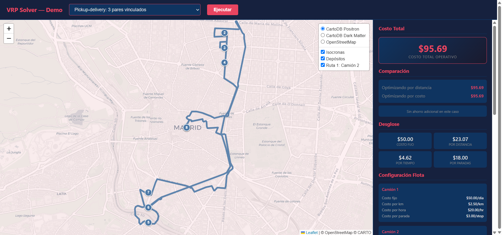

# Accesibilidad y Optimización Territorial

**Diagnóstico de accesibilidad y optimización del despliegue de recursos humanos y materiales para gobiernos**

[](https://opensource.org/licenses/Apache-2.0)
[](https://www.python.org/downloads/)
[]()



---

## Tabla de contenidos

- [Descripción](#descripción)
- [El problema](#el-problema)
- [Cómo funciona](#cómo-funciona)
- [Instalación](#instalación)
- [Demo interactivo](#demo-interactivo)
- [Uso rápido](#uso-rápido)
- [Casos de uso](#casos-de-uso)
- [Roadmap](#roadmap)
- [Pruebas](#pruebas)
- [Contribuir](#contribuir)
- [Licencia](#licencia)
- [Contacto](#contacto)

---

## Descripción

Accesibilidad y Optimización Territorial es una herramienta de código abierto que responde dos preguntas críticas para la planificación de servicios públicos: **¿quién está lejos?** y **cómo se llega?**

La herramienta combina tres capacidades:

1. **Tiempo de viaje real por red vial** — calcula cuánto tarda una persona en llegar desde su comunidad hasta cada servicio disponible (escuela, hospital, centro de vacunación), considerando la red de caminos reales y el modo de transporte (auto, a pie, bicicleta, motocicleta).

2. **Mapas de cobertura por tiempo** — dibuja el área que se puede alcanzar desde cada servicio en un tiempo determinado (15, 30, 60 minutos). Permite identificar qué comunidades quedan fuera del alcance.

3. **Optimización del despliegue de recursos humanos y materiales** — cuando un gobierno necesita desplegar brigadas, vehículos o equipos para llevar servicios a la población (transporte escolar, brigadas de vacunación, distribución de alimentos, inspecciones sanitarias, recolección de residuos), la herramienta calcula la mejor asignación de flota y cuadrillas respetando restricciones reales: capacidad, horarios, habilidades específicas como cadena de frío, descansos, múltiples puntos de salida, y prioridades. La herramienta puede optimizar por menor costo operativo, no solo por distancia o tiempo. Además, soporta operaciones de recogida y entrega vinculada: recoger insumos en un centro de acopio y entregarlos en las comunidades, garantizando que la recogida ocurre antes de la entrega.

---

## El problema

Los gobiernos de la región necesitan responder preguntas como: *¿qué comunidades están demasiado lejos de una escuela secundaria?* *¿cuántos vehículos necesitamos y por dónde los mandamos?* *¿qué porcentaje de la población rural tiene acceso a un hospital en menos de una hora?*

Responder estas preguntas correctamente es complejo:

- **La distancia en línea recta no refleja el tiempo real de viaje**: dos comunidades pueden estar a la misma distancia de un hospital, pero una tiene ruta pavimentada y la otra solo un camino rural.
- **La cobertura no es un círculo**: un servicio no cubre un radio de X kilómetros, sino un área que depende de los caminos disponibles.
- **Planear rutas con restricciones reales es difícil**: capacidad, horarios, cadena de frío, múltiples puntos de salida — hacerlo a mano es inviable para cientos de puntos.

---

## Cómo funciona

```
Datos de servicios y comunidades
         │
         ▼
┌─────────────────────────────────────┐
│  Accesibilidad y Optimización       │
│                                     │
│  Paso 1: ¿Quién está lejos?         │
│  · Tiempo de viaje real por red vial│
│  · Mapa de cobertura por minutos    │
│  · Comunidades fuera de alcance     │
│                                     │
│  Paso 2: ¿Cómo se llega?            │
│  · Filtrar por alcance              │
│  · Calcular mejores rutas           │
│  · Respetar capacidad, horarios,    │
│    capacidades especiales,          │
│    descansos, prioridades           │
│                                     │
│  Paso 3: Entregar resultado         │
│  · Rutas con orden de paradas       │
│  · Tiempos y distancias             │
│  · Costos desglosados               │
│  · Comunidades no atendidas         │
└─────────────────────────────────────┘
         │
         ▼
Rutas optimizadas y diagnóstico de cobertura
listos para integrar al sistema del gobierno
```

La herramienta puede funcionar de dos formas:

- **Con datos reales de red vial**: usando [OpenRouteService](https://openrouteservice.org/) (nivel gratuito disponible), calcula tiempos y distancias reales por los caminos de OpenStreetMap.
- **Con datos sintéticos**: sin conexión a internet ni clave de acceso, estima distancias y tiempos a partir de coordenadas geográficas. Ideal para evaluaciones rápidas y demostraciones.

---

## Instalación

### Requisitos

- Python 3.12+
- [uv](https://docs.astral.sh/uv/) (gestor de paquetes)
- Clave de OpenRouteService (opcional — la herramienta funciona sin ella en modo sintético)

### Pasos

```bash
# 1. Clonar el repositorio
git clone https://github.com/rogelioGuerrero/accesibilidad-territorial.git
cd accesibilidad-territorial

# 2. Instalar dependencias
uv sync

# 3. (Opcional) Configurar OpenRouteService para datos reales de red vial
#    Registrarse en https://openrouteservice.org/ (gratis)
#    Crear archivo .env con:
#    ORS_API_KEY=tu_clave_aqui
#    MATRIX_PROVIDER=ors
#    ISOCHRONE_PROVIDER=ors

# 4. Verificar instalación
uv run pytest tests/ -v
```

---

## Demo interactivo

La herramienta incluye un mapa interactivo con 8 casos predefinidos que se ejecutan sin instalación ni clave de acceso:

```bash
uv run python -m uvicorn vrp_solver.main:app --host 127.0.0.1 --port 8000
```

Abrir http://localhost:8000/demo en el navegador. Casos disponibles:

| Caso | Descripción |
|------|-------------|
| Básico | 1 vehículo, 5 entregas |
| Multi-vehículo | 3 vehículos, 15 entregas con capacidad limitada |
| Multi-depot | 2 puntos de salida, 4 vehículos, 20 entregas |
| Ventanas de tiempo | 2 vehículos, 10 entregas con horarios de entrega |
| Backlog + isocronas | 50 entregas, selección por prioridad y cobertura |
| Pickup-delivery | 3 pares de recogida y entrega vinculados |
| Skills | Vehículo refrigerado vs normal |
| Breaks | 1 vehículo con descanso del conductor |

---

## Uso rápido

### Como API

```bash
# Iniciar el servidor
uv run python -m uvicorn vrp_solver.main:app --host 0.0.0.0 --port 8000
```

```python
import httpx

request = {
    "locations": [
        {"id": "depot", "name": "Depósito Central", "coords": [4.65, -74.10], "type": "depot"},
        {"id": "d1", "name": "Entrega 1", "coords": [4.66, -74.09], "type": "delivery", "weight_demand": 20.0},
        {"id": "d2", "name": "Entrega 2", "coords": [4.64, -74.11], "type": "delivery", "weight_demand": 15.0},
        {"id": "d3", "name": "Entrega 3", "coords": [4.67, -74.08], "type": "delivery", "weight_demand": 10.0},
    ],
    "vehicles": [
        {
            "id": "v1", "name": "Camión 1",
            "start_location_id": "depot", "end_location_id": "depot",
            "weight_capacity": 200.0,
            "fixed_cost": 50.0, "cost_per_km": 2.5, "cost_per_hour": 20.0, "cost_per_stop": 3.0
        }
    ],
    "config": {"time_limit_seconds": 5, "optimize_by": "cost"}
}

response = httpx.post("http://localhost:8000/optimize", json=request)
result = response.json()

for route in result["routes"]:
    print(f"{route['vehicle_name']}: {len(route['stops'])} paradas, "
          f"{route['total_distance']/1000:.1f} km, ${route['cost']['total']:.2f}")
```

### Como librería

```python
from vrp_solver.models import Location, LocationType, Vehicle, SolverConfig, OptimizeRequest
from vrp_solver.solver import VRPSolver

request = OptimizeRequest(
    locations=[
        Location(id="depot", name="Depósito", coords=(4.65, -74.10), type=LocationType.depot),
        Location(id="d1", name="Entrega 1", coords=(4.66, -74.09), type=LocationType.delivery, weight_demand=20.0),
        Location(id="d2", name="Entrega 2", coords=(4.64, -74.11), type=LocationType.delivery, weight_demand=15.0),
    ],
    vehicles=[
        Vehicle(id="v1", name="Camión 1", start_location_id="depot", end_location_id="depot",
                weight_capacity=200.0, fixed_cost=50.0, cost_per_km=2.5, cost_per_hour=20.0, cost_per_stop=3.0)
    ],
    config=SolverConfig(time_limit_seconds=5, optimize_by="cost"),
)

solver = VRPSolver(
    locations=request.locations,
    vehicles=request.vehicles,
    config=request.config,
    matrix_provider="synthetic",  # o "ors" para datos reales
)
result = solver.solve()
print(f"Vehículos usados: {result.statistics.vehicles_used}")
print(f"Distancia total: {result.statistics.total_distance / 1000:.1f} km")
print(f"Costo total: ${result.statistics.total_cost:.2f}")
```

---

## Casos de uso

### Accesibilidad a maternidades de alta complejidad

Un ministerio de salud necesita identificar qué población está fuera del alcance de maternidades de alta complejidad. La herramienta calcula el área alcanzable en 60, 90 y 120 minutos en auto desde cada maternidad, identifica los radios censales que quedan fuera, y calcula qué porcentaje de mujeres en edad reproductiva queda excluida.

### Transporte escolar rural

Una provincia necesita organizar el transporte escolar para 500 niños distribuidos en 80 parajes rurales. La herramienta calcula el tiempo de viaje desde cada paraje hasta cada escuela, asigna cada niño a la escuela más cercana por ruta, y planifica las rutas de los colectivos respetando asientos, horarios y tiempo máximo de viaje.

### Vacunación móvil

Un programa de vacunación despliega brigadas móviles para alcanzar comunidades rurales. La herramienta identifica las comunidades fuera del alcance de los centros fijos y planifica el despliegue de las brigadas considerando cadena de frío, horarios, capacidad de vacunas y habilidades requeridas por equipo.

### Distribución de alimentos escolares

Un programa de alimentación distribuye raciones desde 5 depósitos a 200 escuelas. La herramienta planifica las rutas de los camiones respetando capacidad, horarios de entrega y costo por kilómetro, con desglose de costos por ruta.

---

## Roadmap

- [x] Tiempo de viaje real por red vial entre todos los puntos (también modo sintético sin internet)
- [x] Mapas de cobertura por minutos de viaje con guardado automático
- [x] Planificación de rutas con capacidad, horarios, capacidades especiales, descansos, múltiples puntos de salida, y prioridades
- [x] Filtrado automático de comunidades fuera del alcance
- [x] Desglose de costos por ruta (fijo + distancia + tiempo + paradas)
- [x] Reintento automático entregando la mejor solución parcial
- [x] Manejo de prioridades alta, media y baja
- [x] Agrupación automática por territorio para planificar cientos de comunidades
- [x] Mapa interactivo de demostración con 8 casos predefinidos
- [x] Pruebas automatizadas con datos reales de red vial
- [ ] Módulo de diagnóstico de accesibilidad sin planificar rutas
- [ ] Descubrimiento automático de servicios públicos desde bases de datos abiertas
- [ ] Exportación a mapas interactivos para visualización web
- [ ] Panel web para explorar brechas de cobertura
- [ ] Conectores para fuentes de datos gubernamentales

*Estas funcionalidades están en desarrollo y se incorporarán en futuras versiones.*

---

## Pruebas

```bash
# Ejecutar todas las pruebas
uv run pytest tests/ -v

# Pruebas del solver (con matriz ORS real cacheada)
uv run pytest tests/test_solver.py -v

# Pruebas de regresión
uv run pytest tests/test_fixes.py -v
```

Las pruebas verifican: capacidad de vehículos, ventanas de tiempo, recogidas y entregas vinculadas, múltiples puntos de salida, costos, prioridades, capacidades especiales, descansos del conductor, y manejo de comunidades fuera de cobertura.

---

## Estructura del proyecto

```
accesibilidad-territorial/
├── src/vrp_solver/
│   ├── main.py              # Servidor API (FastAPI)
│   ├── solver.py            # Orquestador del solver
│   ├── model_builder.py     # Construcción del modelo de optimización
│   ├── result_extractor.py  # Extracción y formato de resultados
│   ├── matrix.py            # Matriz de tiempos/distancias (real y sintética)
│   ├── isochrone_cache.py   # Mapas de cobertura con guardado automático
│   ├── node_selector.py     # Filtrado por cobertura y prioridades
│   ├── models.py            # Modelos de datos de entrada y salida
│   ├── validator.py         # Validación de solicitudes
│   ├── breaks.py            # Manejo de descansos del conductor
│   ├── demo.py              # Mapa interactivo de demostración
│   └── utils.py             # Utilidades (distancia haversine, etc.)
├── tests/                   # Pruebas automatizadas
│   ├── fixtures/            # Datos de prueba (matrices reales cacheadas)
│   ├── test_solver.py       # Pruebas del solver
│   ├── test_fixes.py        # Pruebas de regresión
│   ├── test_isochrone.py    # Pruebas de mapas de cobertura
│   └── test_validator.py    # Pruebas de validación
├── scripts/                 # Scripts auxiliares
├── img/                     # Imágenes del README
├── docs/                    # Documentación adicional
├── pyproject.toml
├── LICENSE
└── README.md
```

---

## Contribuir

Las contribuciones son bienvenidas. Áreas donde se busca ayuda:

- **Conectores para fuentes de datos gubernamentales**: INDEC, BAHRA, ministerios sectoriales
- **Casos de uso**: datos reales de escuelas, hospitales, programas sociales
- **Documentación**: guías de implementación por país, traducciones
- **Optimización**: perfiles de transporte adicionales (transporte público, motocicleta)

---

## Licencia

[Apache License 2.0](LICENSE) — permite uso comercial, modificación y distribución con atribución.

---

## Contacto

Para colaboración, adaptación o reportar problemas:

- **GitHub Issues**: [https://github.com/rogelioGuerrero/accesibilidad-territorial/issues](https://github.com/rogelioGuerrero/accesibilidad-territorial/issues)
- **Email**: [info@agtisa.com]

---

*Accesibilidad y Optimización Territorial es un Bien Público Digital candidato al catálogo de Código para el Desarrollo del BID. Ver [BID_CATALOG_DESCRIPTION.md](BID_CATALOG_DESCRIPTION.md) para la descripción completa del catálogo.*
